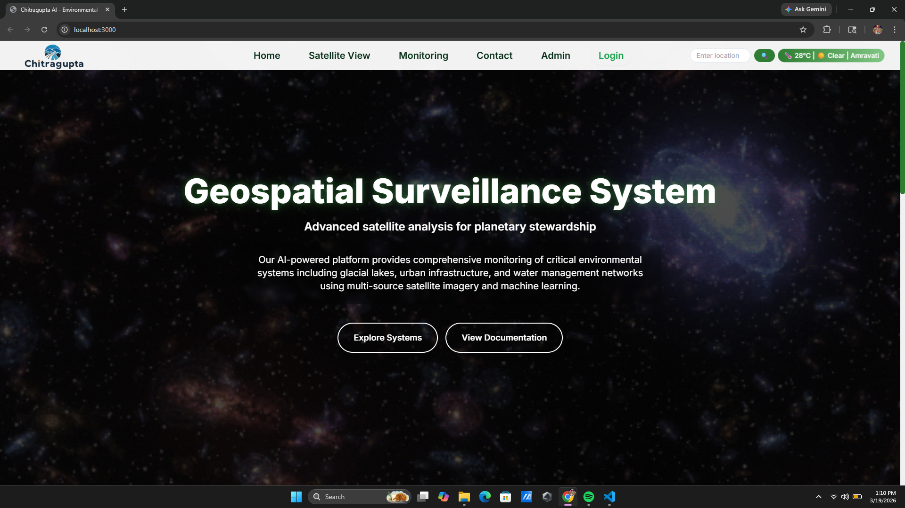
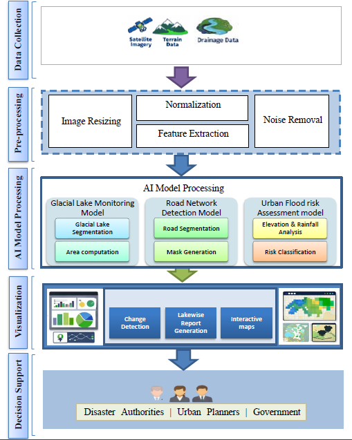
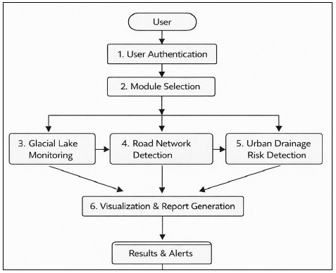
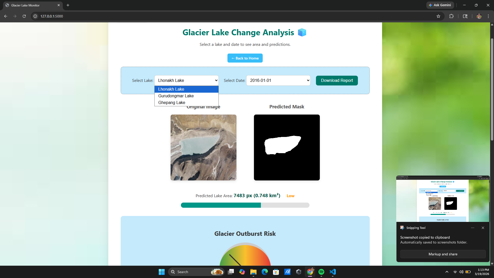
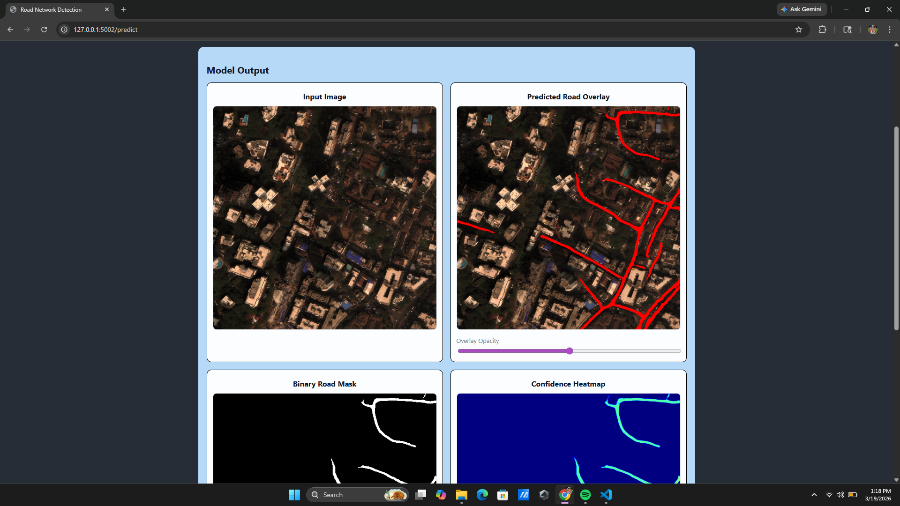
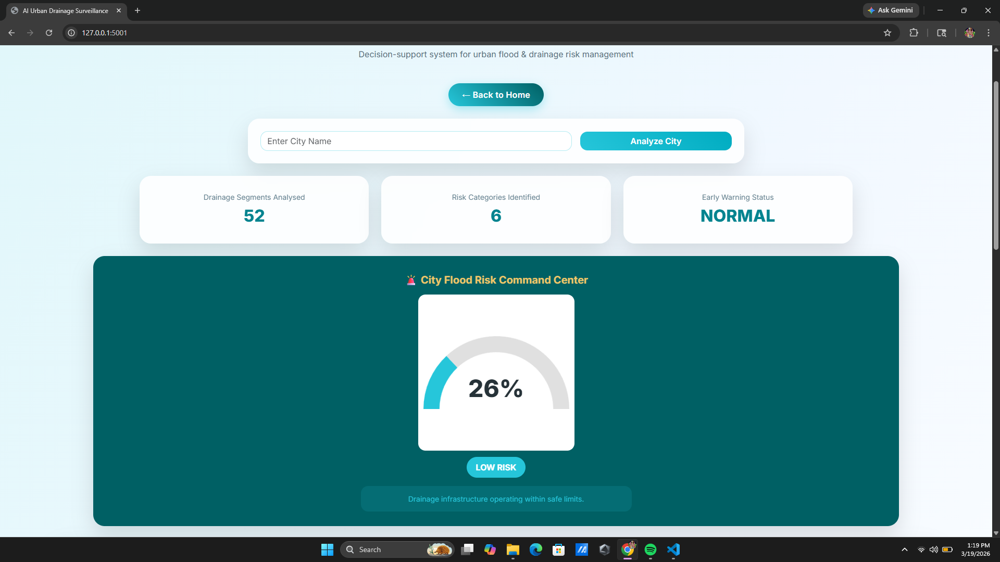
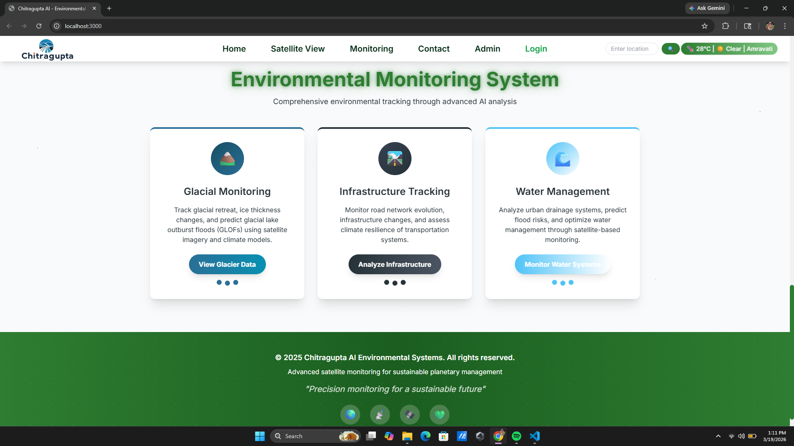
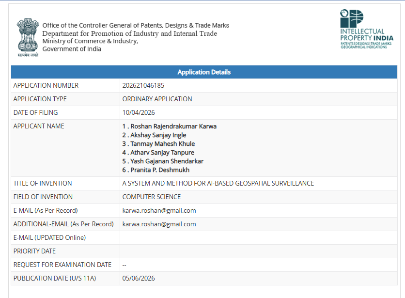

# 🛰️ Chitragupta: AI-Based Geospatial Surveillance System

<p align="center">
  
</p>

[](https://chitragupta-floodrisk.onrender.com/)


Chitragupta is an AI-powered geospatial surveillance platform designed to automate environmental and infrastructure monitoring using satellite imagery and machine learning.

The platform integrates deep learning, computer vision, geospatial analytics, and predictive modeling to support:

* 🏔️ Glacial Lake Monitoring
* 🛣️ Road Network Extraction
* 🌊 Urban Flood Risk Assessment

The system provides an interactive web interface for visualization, analysis, and decision support.

---

## Key Features

* 🛰️ Satellite image analysis
* 🏔️ Glacial lake detection and monitoring
* 🛣️ AI-powered road extraction
* 🌊 Urban flood risk prediction
* 📊 Interactive dashboard
* 📈 Geospatial visualization
* 🤖 Machine Learning & Deep Learning integration
* 🌍 Environmental monitoring and decision support

---

# System Architecture

<p align="center">
  
</p>

---

# Workflow

<p align="center">
  
</p>

---

# Tech Stack

## Frontend

* HTML
* CSS
* JavaScript
* EJS

## Backend

* Node.js
* Express.js

## AI / Machine Learning

* Python
* TensorFlow
* PyTorch
* OpenCV
* Scikit-learn

## Database

* MongoDB

## Geospatial Technologies

* GIS
* Satellite Imagery
* Raster Processing

---

# Project Modules

## 🏔️ Glacial Lake Monitoring

* Deep Learning based segmentation
* Lake boundary extraction
* Environmental monitoring

<p align="center">
  
</p>

---

## 🛣️ Road Network Detection

* Satellite image segmentation
* AI-powered road extraction
* Infrastructure analysis

<p align="center">
  
</p>

---

## 🌊 Urban Flood Risk Assessment

* Machine Learning based flood prediction
* Risk analysis
* Urban planning support

<p align="center">
  
</p>

---

# Dashboard

<p align="center">
  
</p>

---

# Repository Structure

```text
docs/
    architecture.png
    workflow.png
    screenshots/
        Home.png
        Dashboard.png
        Glaciermonitoring.png
        road_detection.png
        Floodrisk.png

glacieroutburst/
road/
urban_drainage/
assets/
```

---

# Installation

```bash
git clone https://github.com/YOUR_USERNAME/Chitragupta.git

cd Chitragupta

npm install
```

Run the application:

```bash
npm start
```

---

# Model Weights

Model weights and large datasets are intentionally excluded from this repository due to their size.

This repository focuses on the implementation, architecture, and source code.

---

# Patent

This project was developed as part of our final-year research work and is associated with a published patent.

<p align="center">
  
</p>
---

# My Contributions

* Team Lead
* System Architecture Design
* AI Module Integration
* Backend Development
* Geospatial Analytics Integration
* End-to-End Project Coordination

---

# Future Scope

* Real-time satellite integration
* Disaster early warning systems
* Multi-region deployment
* Government decision support dashboards
* Cloud-based geospatial analytics

---

# License

This project is intended for educational and research purposes.
